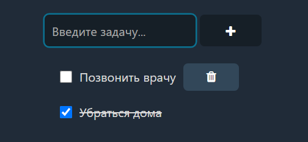
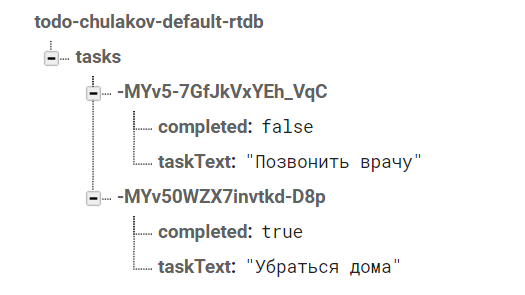

# Todo list на ванильном JavaScript

Версия 1.0 доступна по [ссылке](https://vernicat.github.io/todo-list-js/).

## Функции
- Добавление/удаление задачи
- Завершение задачи
- Вывод сообщения об ошибке, если поле не заполнено
- Добавление по Enter, когда поле в фокусе

# :new: Новое в версии 2.0

- Добавлено хранение данных в Firebase

# Как запустить?

1. Создать проект перейдя по [ссылке](https://console.firebase.google.com/)
1. Зарегистрировать приложение на странице проекта
1. Получить Firebase SDK и конфигурацию для приложения
1. В консоли приложения создать **Realtime Database** в **тестовом** режиме
1. Клонировать репозиторий и в папке `firebase/` создать файл `init.js`
1. Разместить в файле объект `firebaseConfig` из полученной конфигурации
1. Открыть `index.html`